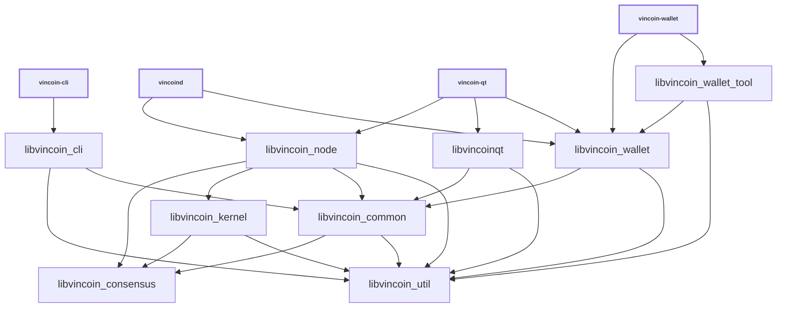

# Libraries

| Name                     | Description |
|--------------------------|-------------|
| *libvincoin_cli*         | RPC client functionality used by *vincoin-cli* executable |
| *libvincoin_common*      | Home for common functionality shared by different executables and libraries. Similar to *libvincoin_util*, but higher-level (see [Dependencies](#dependencies)). |
| *libvincoin_consensus*   | Stable, backwards-compatible consensus functionality used by *libvincoin_node* and *libvincoin_wallet* and also exposed as a [shared library](../shared-libraries.md). |
| *libvincoinconsensus*    | Shared library build of static *libvincoin_consensus* library |
| *libvincoin_kernel*      | Consensus engine and support library used for validation by *libvincoin_node* and also exposed as a [shared library](../shared-libraries.md). |
| *libvincoinqt*           | GUI functionality used by *vincoin-qt* and *vincoin-gui* executables |
| *libvincoin_ipc*         | IPC functionality used by *vincoin-node*, *vincoin-wallet*, *vincoin-gui* executables to communicate when [`--enable-multiprocess`](multiprocess.md) is used. |
| *libvincoin_node*        | P2P and RPC server functionality used by *vincoind* and *vincoin-qt* executables. |
| *libvincoin_util*        | Home for common functionality shared by different executables and libraries. Similar to *libvincoin_common*, but lower-level (see [Dependencies](#dependencies)). |
| *libvincoin_wallet*      | Wallet functionality used by *vincoind* and *vincoin-wallet* executables. |
| *libvincoin_wallet_tool* | Lower-level wallet functionality used by *vincoin-wallet* executable. |
| *libvincoin_zmq*         | [ZeroMQ](../zmq.md) functionality used by *vincoind* and *vincoin-qt* executables. |

## Conventions

- Most libraries are internal libraries and have APIs which are completely unstable! There are few or no restrictions on backwards compatibility or rules about external dependencies. Exceptions are *libvincoin_consensus* and *libvincoin_kernel* which have external interfaces documented at [../shared-libraries.md](../shared-libraries.md).

- Generally each library should have a corresponding source directory and namespace. Source code organization is a work in progress, so it is true that some namespaces are applied inconsistently, and if you look at [`libvincoin_*_SOURCES`](../../src/Makefile.am) lists you can see that many libraries pull in files from outside their source directory. But when working with libraries, it is good to follow a consistent pattern like:

  - *libvincoin_node* code lives in `src/node/` in the `node::` namespace
  - *libvincoin_wallet* code lives in `src/wallet/` in the `wallet::` namespace
  - *libvincoin_ipc* code lives in `src/ipc/` in the `ipc::` namespace
  - *libvincoin_util* code lives in `src/util/` in the `util::` namespace
  - *libvincoin_consensus* code lives in `src/consensus/` in the `Consensus::` namespace

## Dependencies

- Libraries should minimize what other libraries they depend on, and only reference symbols following the arrows shown in the dependency graph below:

<table><tr><td>

</td></tr><tr><td>

**Dependency graph**. Arrows show linker symbol dependencies. *Consensus* lib depends on nothing. *Util* lib is depended on by everything. *Kernel* lib depends only on consensus and util.

</td></tr></table>

- The graph shows what _linker symbols_ (functions and variables) from each library other libraries can call and reference directly, but it is not a call graph. For example, there is no arrow connecting *libvincoin_wallet* and *libvincoin_node* libraries, because these libraries are intended to be modular and not depend on each other's internal implementation details. But wallet code is still able to call node code indirectly through the `interfaces::Chain` abstract class in [`interfaces/chain.h`](../../src/interfaces/chain.h) and node code calls wallet code through the `interfaces::ChainClient` and `interfaces::Chain::Notifications` abstract classes in the same file. In general, defining abstract classes in [`src/interfaces/`](../../src/interfaces/) can be a convenient way of avoiding unwanted direct dependencies or circular dependencies between libraries.

- *libvincoin_consensus* should be a standalone dependency that any library can depend on, and it should not depend on any other libraries itself.

- *libvincoin_util* should also be a standalone dependency that any library can depend on, and it should not depend on other internal libraries.

- *libvincoin_common* should serve a similar function as *libvincoin_util* and be a place for miscellaneous code used by various daemon, GUI, and CLI applications and libraries to live. It should not depend on anything other than *libvincoin_util* and *libvincoin_consensus*. The boundary between _util_ and _common_ is a little fuzzy but historically _util_ has been used for more generic, lower-level things like parsing hex, and _common_ has been used for vincoin-specific, higher-level things like parsing base58. The difference between util and common is mostly important because *libvincoin_kernel* is not supposed to depend on *libvincoin_common*, only *libvincoin_util*. In general, if it is ever unclear whether it is better to add code to *util* or *common*, it is probably better to add it to *common* unless it is very generically useful or useful particularly to include in the kernel.

- *libvincoin_kernel* should only depend on *libvincoin_util* and *libvincoin_consensus*.

- The only thing that should depend on *libvincoin_kernel* internally should be *libvincoin_node*. GUI and wallet libraries *libvincoinqt* and *libvincoin_wallet* in particular should not depend on *libvincoin_kernel* and the unneeded functionality it would pull in, like block validation. To the extent that GUI and wallet code need scripting and signing functionality, they should be get able it from *libvincoin_consensus*, *libvincoin_common*, and *libvincoin_util*, instead of *libvincoin_kernel*.

- GUI, node, and wallet code internal implementations should all be independent of each other, and the *libvincoinqt*, *libvincoin_node*, *libvincoin_wallet* libraries should never reference each other's symbols. They should only call each other through [`src/interfaces/`](`../../src/interfaces/`) abstract interfaces.

## Work in progress

- Validation code is moving from *libvincoin_node* to *libvincoin_kernel* as part of [The libvincoinkernel Project #24303](https://github.com/vincoin/vincoin/issues/24303)
- Source code organization is discussed in general in [Library source code organization #15732](https://github.com/vincoin/vincoin/issues/15732)
